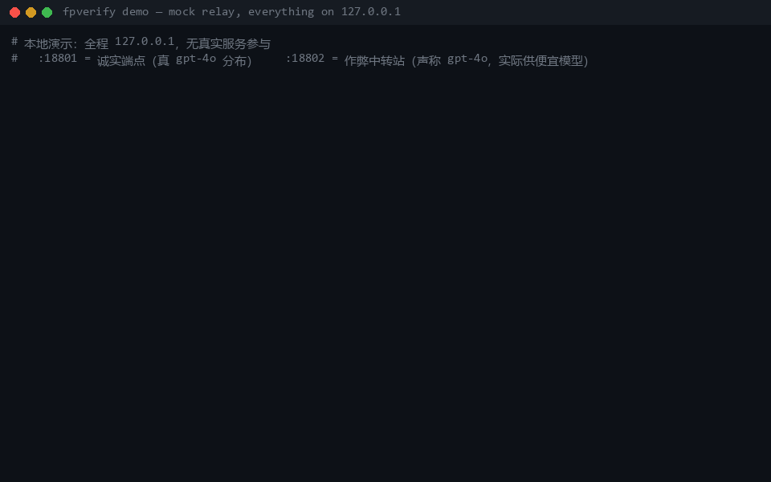
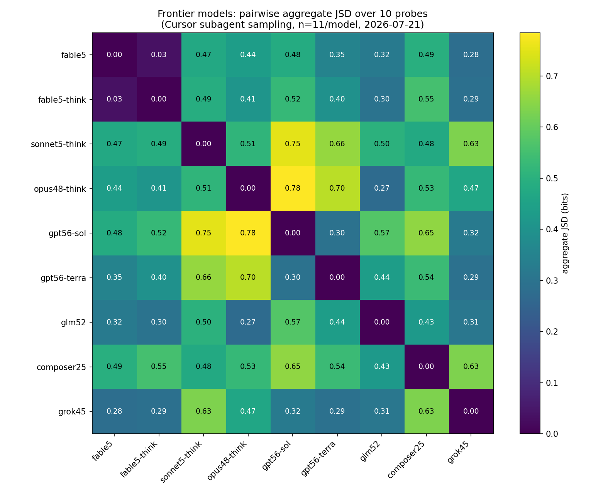

# fpverify — Behavioral Fingerprinting for LLM APIs

Checks whether an OpenAI-compatible endpoint actually serves the model it claims to.

[](LICENSE)
[](https://www.python.org/)
[](https://github.com/Mohamed7415/fpverify/actions/workflows/ci.yml)

[中文文档 →](README.zh-CN.md)

The problem: API resellers and relays can swap the flagship model you paid for with a
cheaper or quantized one. The API format stays the same and the `model` field in the
response still says the flagship name, so nothing at the protocol level gives it away.

The method: LLMs cannot produce random output. Ask a model to "name a random number
between 1 and 100" and its answers concentrate heavily — on different values for
different models. In July 2026 we sampled 9 frontier models × 11 fresh instances each;
the 99 answers contained only 4 distinct values (see
[Measurements](#measurements-frontier-models-cannot-be-random)). The answer
distributions over a few dozen such questions form a stable per-model signature.
fpverify sends one-token probes to an endpoint, compares the observed distribution
against a reference fingerprint (Jensen-Shannon divergence), and decides with a
sequential betting test (e-process). The error rate is bounded: an honest endpoint
is judged FAIL with probability ≤ α = 0.01, valid at any stopping point.



(Real run, not staged: both endpoints live on 127.0.0.1; the cheating one claims
gpt-4o while serving a cheaper model. Regenerate with `experiments/make_demo_gif.py`.)

## Usage

Commands below use `python`; on Windows use `py -3.13 -X utf8` instead.

```bash
git clone https://github.com/Mohamed7415/fpverify
cd fpverify
pip install -r requirements.txt
```

### Case 1: you only have a relay key

Start the local web console:

```bash
python -m webui.server
```

The browser opens `http://127.0.0.1:8765`. Fill in three fields:

| Field | Value |
|---|---|
| Base URL | the relay address, ending in `/v1` |
| API Key | the key the relay gave you |
| Model name | click "fetch model list" and pick from what the relay actually offers |

Leave "library entry" on its default (auto-match by model name). Click start.
Request count = samples per question × questions in the library — a few dozen to
~300 one-token requests with default settings, costing cents, done in minutes.

Verdicts:

| Verdict | Meaning |
|---|---|
| PASS | no evidence of substitution within budget |
| FAIL | behavior deviates significantly from the claimed model's reference (false-positive probability ≤ 0.01), or response-level caching detected |
| BEST_MATCH | claimed model not in the library; reports which library model the behavior matches |
| UNKNOWN | matches nothing in the library |
| INCONCLUSIVE | not enough evidence; re-run with more samples |

Below the verdict the console shows a self-verification table: the claimed model's
most deterministic questions, their reference answers, copy-paste prompts and a
downloadable script. Verification does not require this tool — see Case 2.

Privacy: probe traffic goes directly from your machine to the relay; the key stays in
local process memory, never written to disk or uploaded. The fingerprint library is
public data inside the repo; update it with `git pull`.

CLI equivalent:

```bash
python -m fpverify.cli library        # list the fingerprint library
python -m fpverify.cli identify --base-url https://relay.example/v1 --api-key KEY --model gpt-4o --samples 8
```

Identification degrades in three steps: claimed model in the library → sequential
test verdict (PASS / FAIL); not in the library → report the closest behavioral match
(BEST_MATCH); nothing close → UNKNOWN. The library ships 9 frontier models measured
in July 2026 (`cursor-harness` channel, same-channel comparisons only). References
for the `api` channel are open for community contribution — one enrollment costs
cents; anti-poisoning rules are in [`refs/README.md`](refs/README.md).

### Case 2: verify a verdict without trusting this tool

```bash
python -m fpverify.cli reproduce --claimed gpt-5.6-sol
```

Exports a reproduce pack for that model: the questions where its reference is most
deterministic, with expected answers (GPT-5.6 sol: coin flip = tails 11/11, random
color = orange 11/11). Four ways to run it:

1. Paste `cursor_prompt.md` into Cursor or any agent IDE with subagents; it fans out
   N fresh subagents (same channel as the `cursor-harness` references);
2. `codex_loop.sh` / `codex_loop.ps1` loops `codex exec`, a fresh session per run;
3. `official_api.py` (stdlib only, zero dependencies) samples an official API key
   and prints observed vs. reference side by side;
4. By hand on the official site: one fresh chat per question.

One rule: every sample must come from a fresh conversation or instance. Asking ten
times in one chat is invalid — the model sees its previous answers and varies them.

### Case 3: you have an official API key

The reference fingerprint is enrolled directly from the official channel. No shared
library involved; this is the strongest evidence mode.

```bash
# 1. Enroll a reference from the official API (~720 one-token requests, a few cents;
#    re-enroll after model version bumps)
python -m fpverify.cli enroll \
    --base-url https://api.openai.com/v1 --api-key $OFFICIAL_KEY \
    --model gpt-4o --samples 20 --out ref_gpt4o.json

# 2. Audit any OpenAI-compatible endpoint claiming to serve that model
python -m fpverify.cli audit \
    --base-url https://some-relay.example/v1 --api-key $RELAY_KEY \
    --model gpt-4o --ref ref_gpt4o.json --report audit.json
```

Blatant substitution typically triggers early stopping within ~15 queries (~$0.002).
Reports include the aggregated JSD and reference bands from the underlying paper
(0.140 same-source / 0.227 cross-deployment / 0.463 impostor).

Two self-checks, which double as a test of this project's FPR claim (one cheap
official key is enough):

```bash
# Enroll model A from its official API
python -m fpverify.cli enroll --base-url https://api.deepseek.com/v1 \
    --api-key $KEY --model deepseek-chat --samples 20 --out ref_a.json

# Audit the SAME official endpoint against A's reference: must PASS
python -m fpverify.cli audit --base-url https://api.deepseek.com/v1 \
    --api-key $KEY --model deepseek-chat --ref ref_a.json

# Audit a DIFFERENT model against A's reference: must FAIL
python -m fpverify.cli audit --base-url https://api.deepseek.com/v1 \
    --api-key $KEY --model deepseek-reasoner --ref ref_a.json
```

If an official, direct-connection endpoint FAILs against its own freshly enrolled
reference, open an issue with the audit JSON; that would refute the FPR claim.

## Local demo (no keys required)

This section validates the tool itself; no real service is involved.
`sim/mock_server.py` starts fake endpoints on your machine: `--kind honest` answers
with a gpt-4o-style distribution, `--kind swap` simulates a relay that claims gpt-4o
but serves a cheaper model. Expected outcome: the first PASSes, the second FAILs
within ~15 queries.

```bash
pip install httpx

python sim/mock_server.py --port 18801 --kind honest --model gpt-4o &
python sim/mock_server.py --port 18802 --kind swap   --model gpt-4o &

python -m fpverify.cli enroll --base-url http://127.0.0.1:18801/v1 --api-key mock \
    --model gpt-4o --out ref.json
python -m fpverify.cli audit  --base-url http://127.0.0.1:18801/v1 --api-key mock \
    --model gpt-4o --ref ref.json     # PASS
python -m fpverify.cli audit  --base-url http://127.0.0.1:18802/v1 --api-key mock \
    --model gpt-4o --ref ref.json     # FAIL
```

The mock relay implements nine adversaries (`--kind`): `honest / drift / quantized /
swap / pin / filter_en / true_random / cache / partial_mimic`; see `sim/adversaries.py`.

## Measurements: frontier models cannot be random

July 2026: 9 frontier models, 11 fresh independent instances each (sampled through
Cursor subagents, so model identity is platform-guaranteed). Asked "name a random
number between 1 and 100", the 99 instances produced 4 distinct answers: 73, 47, 37,
42 — with 73 at 65.7%. Median per-question entropy across all models: 0.44 bits;
uniform random would be 6.64 bits.

To check this yourself: open a fresh chat and ask Claude Fable 5 for a random number
between 1 and 100. In our runs, 9 of 11 fresh instances answered 73; the thinking
variant answered 73 in 11 of 11.

Single answers collide (five models share 73 as their mode); the combination of
distributions is what forms the fingerprint:

| Model (July 2026) | Rand 1–100 (mode) | Color | Animal | City | Coin flip |
|---|---|---|---|---|---|
| Claude Fable 5 | **73** (82%) | teal | otter | Kyoto | heads (100%) |
| Claude Fable 5 thinking | **73** (100%) | teal | otter | Kyoto | heads (100%) |
| Claude Sonnet 5 thinking | **37** (91%) | blue | elephant | Paris | heads (100%) |
| Claude Opus 4.8 thinking | **73** (100%) | blue | fox | Tokyo | heads (100%) |
| GPT-5.6 sol | **73** (91%) | orange | otter | Lisbon | tails (100%) |
| GPT-5.6 terra | **47** (36%) | teal | otter | Lisbon | tails (100%) |
| GLM-5.2 | **73** (91%) | teal | fox | Kyoto | heads (91%) |
| Composer 2.5 | **47** (100%) | purple | elephant | Tokyo | heads (91%) |
| Grok 4.5 | **73** (100%) | teal | otter | Lisbon | heads (45%) |



Findings relevant to auditing (full analysis:
[`docs/RESEARCH_NOTES.md`](docs/RESEARCH_NOTES.md) §7):

- Same weights, different reasoning mode → same fingerprint. Fable 5 vs. its thinking
  variant: JSD 0.034, inside the self-noise band. Fingerprints bind to weights; a
  relay silently disabling thinking mode is invisible to them and needs latency
  side-channels.
- Sibling variants are separable. GPT-5.6 sol vs. terra: JSD 0.295, above the noise
  band p95 = 0.217 (n=11, preliminary).
- Family clustering fails. Claude-internal mean distance 0.393 vs. cross-family
  0.481 — same magnitude. Fingerprints track weights, not vendors.
- Language is an independent axis. The same model answers EN and ZH probes with
  nearly disjoint distributions (JSD 0.605–1.0); in Chinese, most models switch
  their most frequent number to 42. Multilingual probes add discriminative power.

Raw data is committed under `experiments/frontier/batch_*.json`; every number and
figure regenerates with fixed seeds:

```bash
python -X utf8 experiments/analyze_frontier.py
```

## Detection performance (controlled simulation)

Validated against nine adversary types with known ground truth (α = 0.01,
auto-calibrated tolerance, budget 600 queries; `experiments/run_evaluation.py`):

| Adversary | Detection | Mean queries to verdict | Est. cost* |
|---|---|---|---|
| Full model swap | 100% | 15 | $0.002 |
| Pinned answers ("always say 73") | 100% | 14 | $0.002 |
| True-random smokescreen | 100% | 14 | $0.002 |
| Filtering known probe phrasings | 100% | 17 | $0.003 |
| Partial distribution mimicry | 100% | 17 | $0.003 |
| Response cache | 100% | 89 | $0.014 |
| Quantized downgrade | 100% | 116 | $0.018 |
| Honest endpoint / benign drift | 0 false alarms in 400 audits | — | — |

\* at flagship pricing ($2.5/M input, $10/M output). The closer the fraud imitates
the real distribution, the more evidence is needed; everything above was caught
within a $0.02 budget.

## Adversarial analysis

Four rounds of red/blue co-evolution in simulation: the relay proposes an evasion,
the detector counters, repeat. Economic constraint: the relay only profits by serving
the cheap model on real traffic, so "serve the flagship whenever a test is suspected"
counts as zero savings. Full ledger: [`docs/COEVOLUTION.md`](docs/COEVOLUTION.md).

- Content-based routing (flagship for anything probe-like): defeated by
  business-native and capability-splitting probes. The relay either routes those to
  the flagship too, or tightens its threshold until its cheap-traffic share drops
  from 0.52 to 0.23. Evasion conflicts with profit.
- Account-based routing (flagship for unfamiliar accounts): defeats one-shot external
  audits. Countermeasure: blend probes into a real account's organic traffic and
  audit passively over time.
- Random dilution (serve the cheap model to a fraction ε of all traffic, blind to
  content and account): the convergence point, and a statistical limit. Any test
  holding FPR ≤ α must leave a tolerance band of width ~δ, and a small enough ε
  hides inside it. In this simulation the attacker's safe window is ε ≈ 0.20–0.28;
  tightening δ pushes benign-drift FPR to 0.092. Catching dilution rate ε costs
  ~1/ε² samples; the only lever is larger enrollment and long-run accumulation.

Summary: structured substitution is caught cheaply; the residual risk is low-rate
random dilution, a trade of "ε saved" against "~1/ε² samples spent by the auditor".
The anytime-valid design is what allows a continuous audit to keep accumulating
that evidence.

## How it works

1. Probe: semantically trivial questions with categorical one-token answers
   ("random number 1–100", "random color", coin flip, …), in multiple phrasings and
   languages to resist string-matching filters.
2. Normalize: canonicalize answers; map unseen answers to an `OTHER` bucket
   (Good-Turing missing-mass handling).
3. Compare: Jensen-Shannon divergence between the endpoint's empirical distribution
   and the reference, aggregated across probe cells.
4. Decide: a sequential betting e-process accumulates evidence query by query.
   Anytime-valid: stop whenever, early-stop obvious cases, type-I error stays ≤ α.
   The benign-drift tolerance δ is auto-calibrated per reference via Dirichlet
   posterior-predictive simulation.

Based on "One Token Is Enough" (Bruckner, arXiv:2607.10252, 2026), which established
single-token distribution fingerprints on 165 models and 326k requests. This project
adds the sequential e-process decision layer (early stopping + anytime-valid FPR
control), adversarial hardening (multilingual paraphrase probes, cache/latency
screening), auto-calibration, and the frontier study above.

## Related tools

| Tool | Approach | Verdict type |
|---|---|---|
| [api-relay-audit](https://github.com/toby-bridges/api-relay-audit) | security scan: injection, SSE integrity, identity keywords | substitution treated as "signals, not proof" |
| [veridrop](https://github.com/canarybyte/veridrop) | protocol conformance + Claude thinking-signature (cryptographic) + usage-field forensics | strong for Claude; protocol-level elsewhere |
| [RelayRadar (AI45Lab)](https://github.com/AI45Lab/RelayRadar) | adaptive discriminative prompts (AB3IT), TVD + permutation p-values | fixed-sample hypothesis test |
| [relay-radar (AetherCore)](https://github.com/AetherCore-Dev/relay-radar) | passive style monitoring + LLMmap probes | accuracy-style score |
| [zing](https://github.com/cenbonew/zing) | capability/knowledge profiles (context window, tokenizer, cutoff) | profile consistency check |
| [KBF (arXiv:2605.29524)](https://arxiv.org/abs/2605.29524) | knowledge-boundary numerical recall | fixed-sample binomial test |

What fpverify does differently:

1. Anytime-valid sequential decisions. The e-process keeps FPR ≤ α at any stopping
   point, which enables early stopping (~15 queries for blatant swaps) and continuous
   low-rate passive auditing — the only regime that survives account-level adaptive
   routing (see the adversarial analysis). Re-running fixed-sample tests continuously
   inflates their real error rates.
2. Auto-calibrated benign-drift tolerance (Dirichlet posterior-predictive), instead
   of a hand-tuned threshold.
3. A July-2026 frontier fingerprint study with platform-guaranteed identity, raw data
   committed, one-command reproduction.
4. A breaking-point analysis that states where detection fails (random dilution
   ε ≈ 0.20–0.28; catching ε costs ~1/ε² samples), rather than implying the detector
   is unbeatable.

veridrop's Claude thinking-signature check is cryptographic and complementary; when
auditing Claude endpoints, run both. Behavioral fingerprints are the layer that works
for every model with no server-side cooperation.

## Project layout

```
fpverify/     reusable library: probes, normalization, JSD, e-process, calibration, nearest-neighbor, library identify, reproduce packs, CLI
refs/         community reference fingerprint library (manifest + per-model distributions, contribution protocol)
webui/        local web console (stdlib server; keys never leave your machine)
sim/          red team: model distributions, adversaries, HTTP mock relay, traffic model, blue-team probes
experiments/  evaluation, frontier study, red/blue co-evolution (FPR, power, budget, distance matrices)
tests/        statistical property tests (fairness, FPR bound, power, end-to-end, co-evolution, library/identify, reproduce)
docs/         research notes (problem, threat model, method, experiments, frontier study, multimodal roadmap) + co-evolution ledger
```

## Roadmap

The decision core (JSD + sequential e-process + calibration) is modality-agnostic:
embed an image/video output, quantize it to a codebook, and the same machinery
applies. Extending substitution detection to image/video generation APIs — with
fixed-seed reproducibility as an extra signal — is the planned v2. Design in
[`docs/RESEARCH_NOTES.md`](docs/RESEARCH_NOTES.md) §8; not implemented yet.

## Limitations

- A verdict is statistical evidence, not cryptographic proof. FAIL means the
  distribution deviates significantly from the reference; causes include model
  substitution, quantization, version rollback, or caching. Keep the JSON report
  and re-audit before drawing conclusions.
- The frontier fingerprints were sampled inside the Cursor agent harness (system
  prompt present, temperature not controlled). They demonstrate non-randomness and
  separability but are not directly comparable to bare-API numbers; n=11 per model
  is small and the self-noise band is wide.
- Same-weights mode changes (thinking on/off) are invisible to the fingerprint;
  detecting them requires latency/length side-channels.
- An adversary that identifies audit traffic at the account level defeats any
  one-shot certification; the countermeasure is continuous, low-rate, blended
  auditing.
- No guarantee against an adversary that perfectly reproduces the target model's
  full conditional distribution — but doing so costs approximately as much as
  running the real model.

## License

MIT
